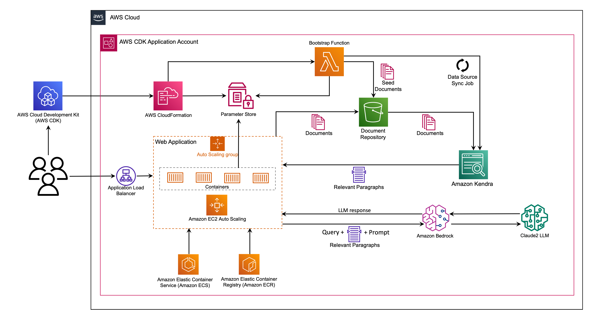
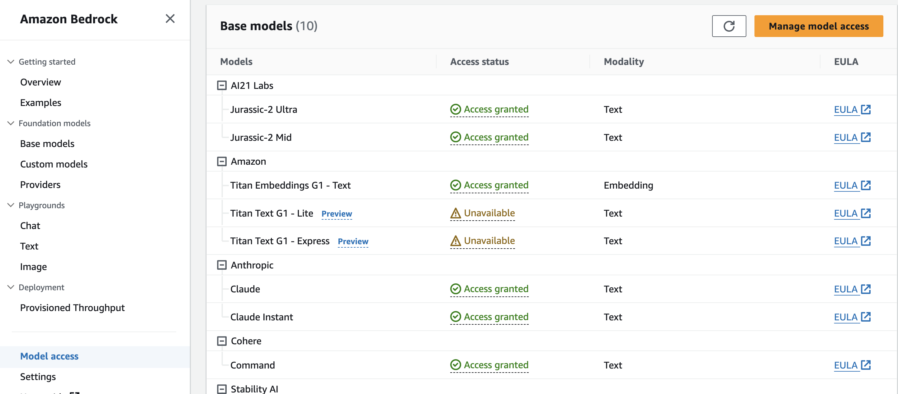
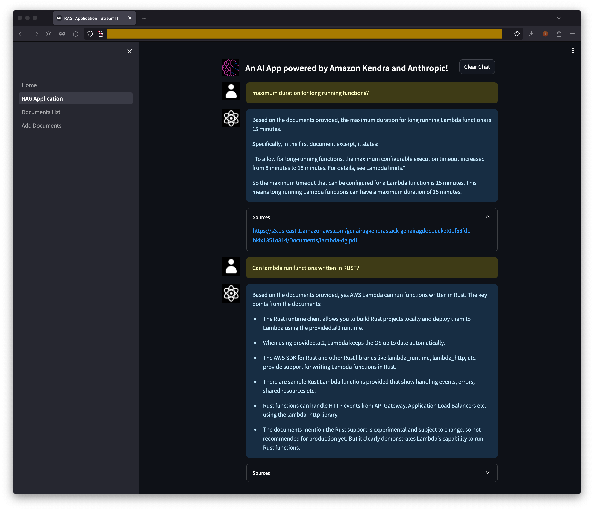
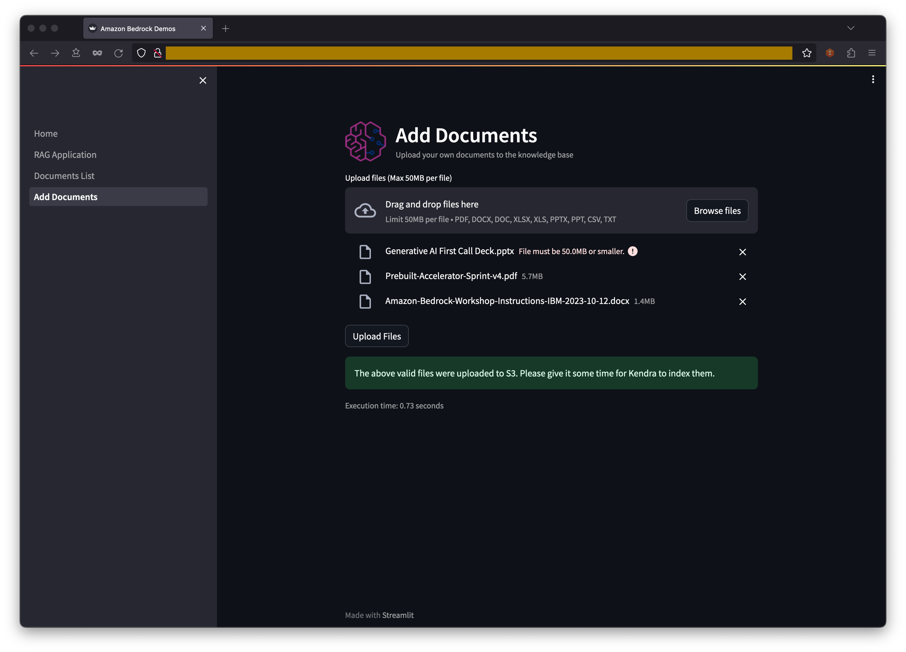
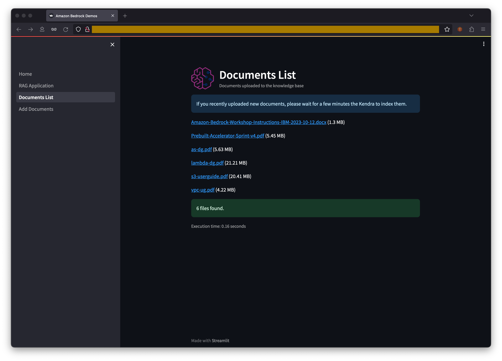

# RAG demo application using Streamlit, Amazon Bedrock, LangChain and Amazon Kendra

This project offers a sample front-end application built with Streamlit to showcase RAG using Amazon Bedrock, LangChain and Amazon Kendra. 
You can deploy this CDK project in your AWS account. Alternatively, you can run the Streamlit application on your local machine. 
See sections below for instructions.

## Architecture



## Prequisites

Make sure you have access to the Bedrock models before using this application. You can request access to the Bedrock models through the console:




### Enable AWS IAM permissions for Bedrock
The AWS identity you assume from your notebook environment (which is the Studio/notebook Execution Role from SageMaker, or could be a role or IAM User for self-managed notebooks), must have sufficient AWS IAM permissions to call the Amazon Bedrock service.

To grant Bedrock access to your identity, you can:

Open the AWS IAM Console
Find your Role (if using SageMaker or otherwise assuming an IAM Role), or else User
Select Add Permissions > Create Inline Policy to attach new inline permissions, open the JSON editor and paste in the below example policy:

```
{
    "Version": "2012-10-17",
    "Statement": [
        {
            "Sid": "BedrockFullAccess",
            "Effect": "Allow",
            "Action": ["bedrock:*"],
            "Resource": "*"
        }
    ]
}
```

If you are running the application from your local machine, make sure you have the following tools installed:
* AWS CLI
* Node.js
* IDE for your programming language
* AWS CDK Toolkit (v2.0 or later)
* Git, JQ, etc
* Docker

## Deploy application in your AWS account

We recommend you use an AWS Cloud9 development enviroment for this project. See this [Cloud9 setup guide](./cloud9.md).

Clone the repository and enter the project directory:

```
git clone https://github.com/Hantzley/amazon-bedrock-kendra-rag-demo.git
cd amazon-bedrock-kendra-rag-demo

```

Create a virtualenv on MacOS or Linux:

```
python3 -m venv .venv
```

After the init process completes and the virtualenv is created, you can use the following
step to activate your virtualenv.

```
source .venv/bin/activate
```


Once the virtualenv is activated, you can install the required dependencies.

```
pip install -r requirements.txt
```

If your account is not yet boostrapped for CDK, execute the following command:

```
cdk bootstrap
```

At this point you can now list the stacks in the project.

```
cdk ls
```
You should see the following output:

```
GenAiRagVpcStack
GenAiRagKendraStack
GenAiRagWebStack
```

Deploy the application as a container on Elastic Container Services in our AWS account:

```
cdk deploy GenAiRagKendraStack GenAiRagWebStack
```
The `GenAiRagKendraStack` and `GenAiRagWebStack` depends on `GenAiRagVpcStack`. CDK will resolve that dependency and automatically deploy `GenAiRagVpcStack` first.

Copy the `WebApplicationServiceURL` from the output and paste it on your browser.


## Run application on your local machine

Alternatively, you can execute the Streamlit application on your local machine:

```
cd web-app
streamlit run Home.py --server.maxUploadSize 50
```

The application should open in your browser.


Enjoy!


## Screenshots

### RAG Application




### Documents upload




## Documents list


