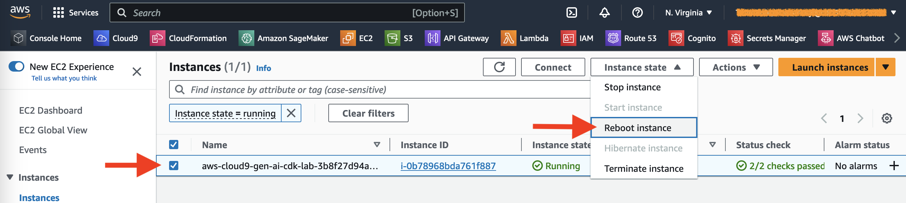
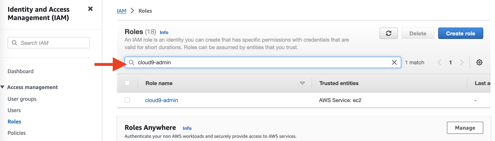
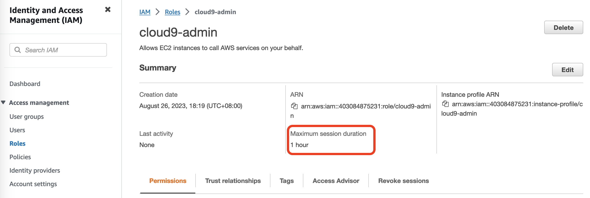

## Setup a Cloud9 Development Environment

**What is AWS Cloud9?**
* A cloud-based integrated development environment (IDE) that lets you write, run, and debug your code with just a browser.
* Comes prepackaged with essential tools for popular programming languages, including JavaScript, Python, and PHP.
* Quickly share your development environment with your team, enabling you to pair program and track each other's inputs in real time.

### Create a Cloud9 instance

Launch Cloud9 in `us-east-1` for this workshop: https://us-east-1.console.aws.amazon.com/cloud9/home?region=us-east-1 

1. Select Create environment
2. Name it `gen-ai-cdk-lab`, and click Next
3. Choose `m5.large` for `Instance type`, take all default values and click Next
4. Select `4 hours` for `Timeout`
5. Review Environment name and settings then click Create environment

### Increase the EBS volume of the Cloud9 instance

1. In the EC2 console, select the cloud9 instance

2. Click on `Storage` tab and select the volume

   

3. From `Actions` drop down menu, select `Modify volume`

   

4. Change the volume size to 50GB

5. Select the Cloud9 instance in the EC2 console and reboot the instance

   

### Create an Administrator role for your Cloud9 instance

1. Follow this [deep link](https://console.aws.amazon.com/iam/home#/roles$new?step=review&commonUseCase=EC2%2BEC2&selectedUseCase=EC2&policies=arn:aws:iam::aws:policy%2FAdministratorAccess) to create an IAM role with Administrator access.

2. Confirm that `AWS service` and `EC2` are selected, then click Next to view permissions.

3. Confirm that `AdministratorAccess` is checked, then click Next: Tags to assign tags.

4. Take the defaults, and click Next: Review to review.

5. Enter `cloud9-admin` for the Name, and click Create role.

6. Find the `cloud9-admin` role and change the session duration to `4 hours`

   

   

   By default, the maximum session duration is 1 hour.
   
   
   
   
   
   Edit this role and change the maximum session duration to 4 hours.
   
   

### Attach the Administrator role to your Cloud9 instance

1. Navigate to the [EC2 Console](https://console.aws.amazon.com/ec2/v2/home?region=us-east-1) to find your Cloud9 EC2 instance

2. Select the instance, then choose `Actions / Security / Modify IAM role`

3. Choose `cloud9-admin` from the IAM Role drop down, and select `Update IAM role`

   

   

### Update your Cloud9 IAM settings
1. Return to your workspace and click the gear icon (in top right corner), or click to open a new tab and choose “Open Preferences”

2. Select `AWS SETTINGS`

3. Turn off AWS managed temporary credentials

4. Close the Preferences tab

   

### Initialize your Cloud9 development environment

1. In the Cloud9 console, select `Open environment`

2. In the Cloud9 environment terminal, check disk size and preinstalled dev tools

   

